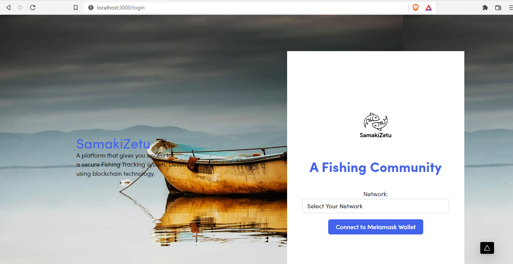
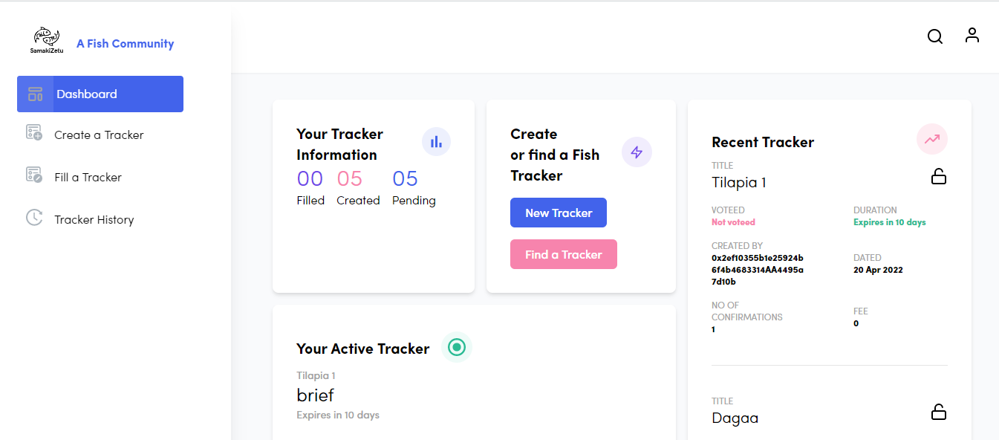
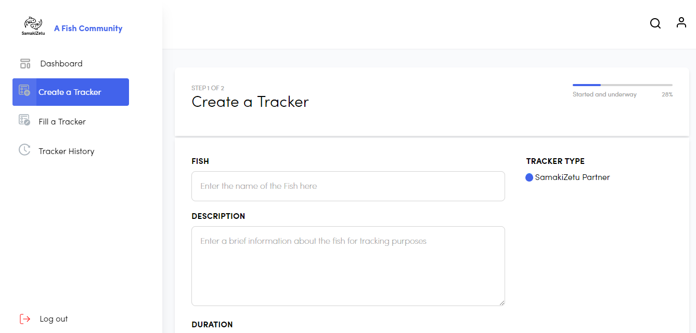
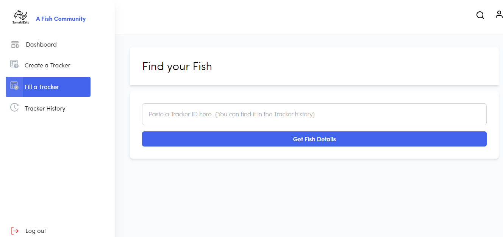
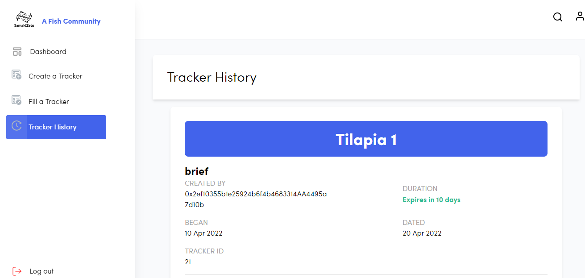

# Project Name
> Samakizetu is an organization that is centered around growth and inclusivity of both genders in fish farming 

## Table of Contents
* [General Info](#general-information)
* [Technologies Used](#technologies-used)
* [Features](#features)
* [Screenshots](#screenshots)
* [Prerequisite](#prerequisite)
* [Configuration](#configuration)
* [Project Status](#project-status)
* [Room for Improvement](#room-for-improvement)
* [Acknowledgements](#acknowledgements)
* [Contact](#contact)

## General Information
-Samakizetu uses blockchain technology to track the fish from the fisherman/fisherwoman and thus eliminates middlemen.
-Samakizetu aims at solving issues such as: exploitation by middlemen leading to little to no profits made and to provide boats for women so as not to engage in sex in exchange for fish and increasing employment opportunities
-The solution is geared towards eliminating middlemen which makes the fish farmer via Samakizetu to have direct link to the potential customer.This increases their profits and increases accoutability

## Technologies Used
- Tech1 - Web3
- Tech2 - next.js


## Features
- Login using metamask Id
- Add a product if you are a fish farmer through which     customers can track your product
- Pull a transaction history of the product


## Screenshots







## Prerequisite
The project requirements are that the project is able to promote Gender Equality through the use of Blockchain Technology.
The other project requires that it should:
1. Have a metamask wallet.


## Configuration
Clone the project

```
  git clone https://github.com/essyy/Samakizetu.git
```

Go to the project directory

```
  cd Samakizetu
```

Install dependencies

```
  yarn install
```

Compile the smart contract:

```
  npx hardhat compile
```

Start the development server

```bash
  yarn dev
```
Open [http://localhost:3000](http://localhost:3000)


## Project Status
The project is: _in progress_  


## Room for Improvement
Future works
- Addition of QR scanning code and NFTs 
- Ability to stake their tokens


## Acknowledgements
-This project was inspired by the current economic state of the fish farmers
-Many thanks to Evans Bet, Boaz Leleina, Jayson Waigwa, Esther Mbugua, Dennis Mbiraru


## Contact
- Created by BlockFive

